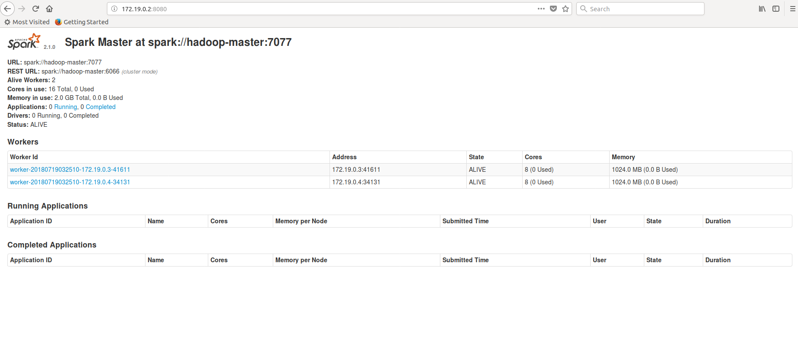

# 实验十三 Spark实验：部署Spark集群
## 13.1 实验目的
能够理解Spark存在的原因，了解Spark的生态圈，理解Spark体系架构并理解Spark计算模型。学会部署Spark集群并启动Spark集群，能够配置Spark集群使用HDFS。

## 13.2 实验要求
实验结束时能构建Spark集群：master上部署主服务Master，slave节点上部署从服务Worker；集群搭建好后，提交并运行Spark示例WorkCount。

## 13.3 实验原理
### 13.3.1 Spark简介
Spark是一个高速的**通用型集群计算框架**，其内部内嵌了一个用于执行DAG（有向无环图）的工作流引擎，能够将DAG类型的Spark-App拆分成Task序列并在底层框架上运行。

在程序接口层，Spark为当前主流语言都提供了编程接口，如用户可以使用Scala、Java、Python、R等高级语言直接编写Spark-App。此外，在核心层之上，Spark还提供了诸如SQL、Mllib、GraphX、Streaming等专用组件，这些组件内置了大量专用算法，充分利用这些组件，能够大大加快Spark-App开发进度。  

一般称Spark Core为Spark，Spark Core处于存储层和高层组建层之间，定位为计算引擎，核心功能是并行化执行用户提交的DAG型Spark-App。目前，Spark生态圈主要包括Spark Core和基于Spark Core的独立组件（SQL、Streaming、Mllib和Graphx）。

### 13.3.2 Spark适用场景
（1）Spark是基于内存的迭代计算框架，适用于需要**多次操作特定数据集**的应用场合。  
（2）由于RDD的特性，Spark不适用那种异步细粒度更新状态的应用，例如web服务的存储或者是增量的web爬虫和索引。  
（3）数据量不是特别大，但是要求实时统计分析需求。

## 13.4 安装部署Spark
安装spark的步骤大体可分为:  
(1)安装JDK  
(2)安装hadoop   
(3)安装scala    
(4)安装spark并修改配置文件  

### 13.4.1 安装JDK

修改 jdk 的环境变量
`vim /etc/profile`，添加下面内容
```
export JAVA_HOME=/usr/local/java
export JRE_HOME=/usr/local/java/jre
export PATH=$PATH:$JAVA_HOME/bin:$JRE_HOME/bin
```
生效环境变量 `source /etc/profile`  
测试
```
root@master:~# java -version
java version "1.8.0_171"
Java(TM) SE Runtime Environment (build 1.8.0_171-b11)
Java HotSpot(TM) 64-Bit Server VM (build 25.171-b11, mixed mode)
```

### 13.4.2 安装hadoop
按照之前的步骤部署 hadoop


### 13.4.3 安装scala
首先要明确,JDK,hadoop,scala,spark之前的版本肯定存在**版本兼容问题**，hadoop是2.7.7的版本，不算太新也不算太旧，在网上找了spark2.1的版本（2016年发布）的安装文档，对应使用的scala版本是2.12.2.

安装过程跟JDK相似，[下载tar包](https://www.scala-lang.org/download/all.html)，解压，导入环境变量。
```
vim /etc/profile
```

添加以下内容  
```
export SCALA_HOME=/usr/local/scala
export PATH=$PATH:$SCALA_HOME/bin
```  
`source /etc/profile` ，生效环境变量。

输入命令scala检测是否成功安装  
```
root@master:~# scala
Welcome to Scala 2.12.2 (Java HotSpot(TM) 64-Bit Server VM, Java 1.8.0_171).
Type in expressions for evaluation. Or try :help.

scala> 
```
成功安装，输入:q可退出。

### 13.4.4 安装spark
从官网[下载2.1.0版本的spark](http://spark.apache.org/downloads.html)
，解压到路径 `/usr/local/spark` 目录下，进入 `/usr/local/spark/conf` 目录下。

要修改的配置文件是 `spark-env.sh` 和 `slaves`, 与 hadoop 部署相似。  

**spark-env.sh**:  
```
root@master:/usr/local/spark/conf# cp spark-env.sh.template spark-env.sh
root@master:/usr/local/spark/conf# vim spark-env.sh      
```  

在文件末尾添加以下内容:  
```
export JAVA_HOME=/usr/local/java
export SCALA_HOME=/usr/local/scala
export HADOOP_HOME=/usr/local/hadoop
export HADOOP_CONF_DIR=/usr/local/hadoop/etc/hadoop

export SPARK_MASTER_IP=master
export SPARK_WORKER_MEMORY=1g
```  
- **spark_MASTER_IP** 是指定master节点的IP  
- **SPARK_WORK_MEMORY** 决定在每一个Worker节点上可用的最大内存，增加这个数可以在内存中缓存更多数据，但一定要给Slave的操作系统和其他服务预留足够内存  

根据各个节点的配置还有很多可以补充的配置设定都可以在这里调整（如指定worker节点cpu的运行cores数）。  

**slaves**:  
与hadoop的slaves文件一致，就是指定worker节点的主机名。  
```
root@master:/usr/local/spark/conf# cp slaves.template slaves
root@master:/usr/local/spark/conf# vim slaves  
```
添加内容:  
```
slave1
slave2
```

添加spark的环境变量, `vim  /etc/profile` 
```
export SPARK_HOME=/usr/local/spark
export PATH=$PATH:$SPARK_HOME/bin:$SPARK_HOME/sbin
```  

`source /etc/profile`  ，生效环境变量。

在 `spark-conf.sh` 中导入 `JAVA_HOME`
在 `spark-env.sh` 中导入 `HAOOP_CONF_DIR`
### 13.4.5 启动并测试spark
在启动spark之前，先确保启动了hadoop，进入/usr/local/spark/sbin目录下启动脚本:  
```
root@master:/usr/local/spark/sbin# ./start-all.sh 
starting org.apache.spark.deploy.master.Master, logging to /usr/local/spark/logs/spark-root-org.apache.spark.deploy.master.Master-1-master.out
slave2: Warning: Permanently added 'slave2,172.19.0.4' (ECDSA) to the list of known hosts.
slave1: Warning: Permanently added 'slave1,172.19.0.3' (ECDSA) to the list of known hosts.
slave2: starting org.apache.spark.deploy.worker.Worker, logging to /usr/local/spark/logs/spark-root-org.apache.spark.deploy.worker.Worker-1-slave2.out
slave1: starting org.apache.spark.deploy.worker.Worker, logging to /usr/local/spark/logs/spark-root-org.apache.spark.deploy.worker.Worker-1-slave1.out
```  

通过Jps查看各节点的进程:  

**Master**:  
```
root@master:/usr/local/spark/sbin# jps
1260 Jps
558 ResourceManager
383 SecondaryNameNode
175 NameNode
1167 Master
```  

**Slave**:  
```
root@slave1:~# jps
71 DataNode
583 Jps
184 NodeManager
488 Worker
```  
Master节点成功启动Master, Slave节点成功启动Worker,证明spark成功启动。  

进入Spark-shell:  
```
root@master:~# spark-shell
Setting default log level to "WARN".
To adjust logging level use sc.setLogLevel(newLevel). For SparkR, use setLogLevel(newLevel).
18/07/19 03:29:16 WARN util.NativeCodeLoader: Unable to load native-hadoop library for your platform... using builtin-java classes where applicable
18/07/19 03:29:35 WARN metastore.ObjectStore: Version information not found in metastore. hive.metastore.schema.verification is not enabled so recording the schema version 1.2.0
18/07/19 03:29:35 WARN metastore.ObjectStore: Failed to get database default, returning NoSuchObjectException
18/07/19 03:29:38 WARN metastore.ObjectStore: Failed to get database global_temp, returning NoSuchObjectException
Spark context Web UI available at http://172.19.0.2:4040
Spark context available as 'sc' (master = local[*], app id = local-1531970957469).
Spark session available as 'spark'.
Welcome to
      ____              __
     / __/__  ___ _____/ /__
    _\ \/ _ \/ _ `/ __/  '_/
   /___/ .__/\_,_/_/ /_/\_\   version 2.1.0
      /_/
         
Using Scala version 2.11.8 (Java HotSpot(TM) 64-Bit Server VM, Java 1.8.0_171)
Type in expressions to have them evaluated.
Type :help for more information.

scala> 
```

Master节点ip为 172.19.0.2 ,主机浏览器访问 172.19.0.2:8080 访问web界面:  
  

## 13.5 实验结果
最后我们使用spark-shell测试一个wordcount:  

首先创建一个测试文件wordcount.txt,内容  
```
Hello hadoop
hello spark
hello bigdata
```
分隔符为空格,接着上传到HDFS,并打开spark-shell:  
```
root@master:~# hadoop fs -put wordcount.txt /
root@master:~# spark-shell
Setting default log level to "WARN".
To adjust logging level use sc.setLogLevel(newLevel). For SparkR, use setLogLevel(newLevel).
18/07/19 03:56:53 WARN util.NativeCodeLoader: Unable to load native-hadoop library for your platform... using builtin-java classes where applicable
18/07/19 03:57:02 WARN metastore.ObjectStore: Failed to get database global_temp, returning NoSuchObjectException
Spark context Web UI available at http://172.19.0.2:4040
Spark context available as 'sc' (master = local[*], app id = local-1531972614087).
Spark session available as 'spark'.
Welcome to
      ____              __
     / __/__  ___ _____/ /__
    _\ \/ _ \/ _ `/ __/  '_/
   /___/ .__/\_,_/_/ /_/\_\   version 2.1.0
      /_/
         
Using Scala version 2.11.8 (Java HotSpot(TM) 64-Bit Server VM, Java 1.8.0_171)
Type in expressions to have them evaluated.
Type :help for more information.

scala> val file=sc.textFile("hdfs://master:9000/wordcount.txt")
file: org.apache.spark.rdd.RDD[String] = hdfs://master:9000/wordcount.txt MapPartitionsRDD[13] at textFile at <console>:24

scala> val rdd = file.flatMap(line => line.split(" ")).map(word => (word,1)).reduceByKey(_+_)
rdd: org.apache.spark.rdd.RDD[(String, Int)] = ShuffledRDD[16] at reduceByKey at <console>:26

scala> rdd.collect()
res0: Array[(String, Int)] = Array((Hello,1), (hello,2), (bigdata,1), (spark,1), (hadoop,1))

scala> rdd.foreach(println)
(spark,1)
(hadoop,1)
(Hello,1)
(hello,2)
(bigdata,1)

scala> :quit
```

实际代码:  
```
val file=sc.textFile("hdfs://master:9000/wordcount.txt")  
val rdd = file.flatMap(line => line.split(" ")).map(word => (word,1)).reduceByKey(_+_)  
rdd.collect()  
rdd.foreach(println)
```