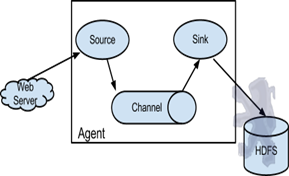
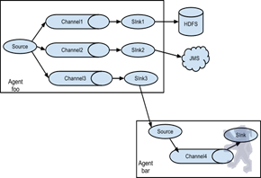

# 实验二十六 文件数据Flume至HDFS

## 26.1 实验目的  
1. 掌握Flume的安装部署；  
2. 掌握一个agent中source、sink、channel组件之间的关系；  
3. 加深对Flume结构和概念的理解；  
4. 掌握Flume的编码方法及启动任务方法。  

## 26.2 实验要求  
1. 在一台机器上(本例以master为例)部署Flume；  
2. 实时收集本地hadoop的日志的最新信息然后将收集到日志信息以一分钟一个文件的形式写入HDFS目录中。  

## 26.3 实验原理  
Flume是Cloudera提供的**一个高可用的，高可靠的，分布式的海量日志采集、聚合和传输的系统**，Flume支持在日志系统中定制各类数据发送方，用于收集数据；同时，Flume提供对数据进行简单处理，并写到各种数据接受方（可定制）的能力。　　

Flume提供对数据进行简单处理，并写到各种数据接受方（可定制）的能力。 Flume提供了从 console（控制台）、RPC（Thrift-RPC）、text（文件）、tail（UNIX tail）、syslog（syslog日志系统，支持TCP和UDP等2种模式），exec（命令执行）等数据源上收集数据的能力。　　

当前Flume有两个版本 **Flume 0.9X版本的统称Flume-og，Flume1.X版本的统称Flume-ng** 。由于Flume-ng 经过重大重构，与 Flume-og 有很大不同，使用时请注意区分。  

Flume-og 采用了多Master的方式。为了保证配置数据的一致性，Flume 引入了ZooKeeper，用于保存配置数据，ZooKeeper本身可保证配置数据的一致性和高可用，另外，在配置数据发生变化时，ZooKeeper可以通知Flume Master节点。Flume Master间使用 gossip 协议同步数据。  

Flume-ng 最明显的改动就是取消了集中管理配置的 Master和Zookeeper，变为一个纯粹的传输工具。Flume-ng另一个主要的不同点是读入数据和写出数据现在由不同的工作线程处理（称为Runner）。 在Flume-og中，读入线程同样做写出工作（除了故障重试）。如果写出慢的话（不是完全失败），它将阻塞 Flume 接收数据的能力。这种异步的设计使读入线程可以顺畅的工作而无需关注下游的任何问题。  

**Flume以agent为最小的独立运行单位。一个agent就是一个JVM。单agent由Source、Sink和Channel三大组件构成**，如图所示:  
  

值得注意的是，**Flume提供了大量内置的Source、Channel和Sink类型。不同类型的Source,Channel和Sink可以自由组合。组合方式基于用户设置的配置文件，非常灵活。比如：Channel可以把事件暂存在内存里，也可以持久化到本地硬盘上。Sink可以把日志写入HDFS, HBase，甚至是另外一个Source等等。Flume支持用户建立多级流，也就是说，多个agent可以协同工作，并且支持Fan-in、Fan-out、Contextual Routing、Backup Routes**，这也正是强大之处。如图所示：  
  

### 26.1 flume的特点  
flume是一个分布式、可靠、和高可用的海量日志采集、聚合和传输的系统。**支持在日志系统中定制各类数据发送方，用于收集数据;同时，Flume提供对数据进行简单处理，并写到各种数据接受方(比如文本、HDFS、Hbase等)的能力**。  

flume的数据流由事件(Event)贯穿始终。**事件是Flume的基本数据单位，它携带日志数据(字节数组形式)并且携带有头信息，这些Event由Agent外部的Source生成，当Source捕获事件后会进行特定的格式化，然后Source会把事件推入(单个或多个)Channel中。你可以把Channel看作是一个缓冲区，它将保存事件直到Sink处理完该事件。Sink负责持久化日志或者把事件推向另一个Source**。  

### 26.3.2 flume的可靠性  
当节点出现故障时，日志能够被传送到其他节点上而不会丢失。Flume提供了三种级别的可靠性保障，从强到弱依次分别为：end-to-end（收到数据agent首先将event写到磁盘上，当数据传送成功后，再删除；如果数据发送失败，可以重新发送。），Store on failure（这也是scribe采用的策略，当数据接收方crash时，将数据写到本地，待恢复后，继续发送），Besteffort(数据发送到接收方后，不会进行确认)。  

## 26.4 实验步骤  
实验只需要用到hadoop,实验开始前先启动好hadoop。

### 26.4.1 下载flume并解压  
[下载链接](http://archive.apache.org/dist/flume/)  
下载的是1.5.2的版本，下载后解压至目录/usr/local/flume  

### 26.4.2 编写test.conf  
进入conf目录，新建test.conf文件并添加以下配置内容:  
```
#定义agent中各组件名称
agent1.sources=source1
agent1.sinks=sink1
agent1.channels=channel1

# source1组件的配置参数
agent1.sources.source1.type=exec
#此处的文件/home/source.log需要手动生成，见后续说明
agent1.sources.source1.command=tail -n +0 -F /home/source.log

# channel1的配置参数
agent1.channels.channel1.type=memory
agent1.channels.channel1.capacity=1000
agent1.channels.channel1.transactionCapactiy=100

# sink1的配置参数
agent1.sinks.sink1.type=hdfs
agent1.sinks.sink1.hdfs.path=hdfs://master:9000/flume/data
agent1.sinks.sink1.hdfs.fileType=DataStream
#时间类型
agent1.sinks.sink1.hdfs.useLocalTimeStamp=true
agent1.sinks.sink1.hdfs.writeFormat=TEXT
#文件前缀
agent1.sinks.sink1.hdfs.filePrefix=%Y-%m-%d-%H-%M
#60秒滚动生成一个文件
agent1.sinks.sink1.hdfs.rollInterval=60
#HDFS块副本数
agent1.sinks.sink1.hdfs.minBlockReplicas=1
#不根据文件大小滚动文件
agent1.sinks.sink1.hdfs.rollSize=0
#不根据消息条数滚动文件
agent1.sinks.sink1.hdfs.rollCount=0
#不根据多长时间未收到消息滚动文件
agent1.sinks.sink1.hdfs.idleTimeout=0
# 将source和sink 绑定到channel
agent1.sources.source1.channels=channel1
agent1.sinks.sink1.channel=channel1
```  

编写完后，文件中设计的目录及文件都要在任务提交前创建好。  

进入/home目录创建source.log(实际监测变化的文件):  
```
root@master:/usr/local/flume/conf# cd /home/
root@master:/home# touch source.log
```

sink将文件写至HDFS,在HDFS创建/flume/data目录:  
```
root@master:~# hadoop fs -mkdir /flume
root@master:~# hadoop fs -mkdir /flume/data
root@master:~# hadoop fs -lsr /
lsr: DEPRECATED: Please use 'ls -R' instead.
drwxr-xr-x   - root supergroup          0 2018-08-06 03:47 /flume
drwxr-xr-x   - root supergroup          0 2018-08-06 03:47 /flume/data
```  

### 26.4.3 启动Flume  
```
root@master:/usr/local/flume/bin# ./flume-ng agent --conf conf --conf-file /usr/local/flume/conf/test.conf --name agent1 -Dflume.root.logger=DEBUG,console
```

看到  
```
18/08/06 03:50:07 INFO source.ExecSource: Exec source starting with command:tail -n +0 -F /home/source.log
18/08/06 03:50:07 INFO instrumentation.MonitoredCounterGroup: Monitored counter group for type: SINK, name: sink1: Successfully registered new MBean.
18/08/06 03:50:07 INFO instrumentation.MonitoredCounterGroup: Component type: SINK, name: sink1 started
18/08/06 03:50:07 INFO instrumentation.MonitoredCounterGroup: Monitored counter group for type: SOURCE, name: source1: Successfully registered new MBean.
18/08/06 03:50:07 INFO instrumentation.MonitoredCounterGroup: Component type: SOURCE, name: source1 started
```
即启动成功  

新开一个终端进入master容器，往/home/source.log文件写入内容:  
```
root@master:/home# echo "aa" >> source.log
```

在另一个终端可观察到:  
```
18/08/06 03:53:06 INFO hdfs.BucketWriter: Creating hdfs://master:9000/flume/data/2018-08-06-03-53.1533527586309.tmp
18/08/06 03:54:04 INFO hdfs.HDFSDataStream: Serializer = TEXT, UseRawLocalFileSystem = false
18/08/06 03:54:07 INFO hdfs.BucketWriter: Renaming hdfs://master:9000/flume/data/2018-08-06-03-53.1533527586309.tmp to hdfs://master:9000/flume/data/2018-08-06-03-53.1533527586309
18/08/06 03:54:07 INFO hdfs.HDFSEventSink: Writer callback called.

```

查看HDFS /flume/data目录:  
```
root@master:/home# hadoop fs -ls /flume/data
Found 2 items
-rw-r--r--   2 root supergroup          3 2018-08-06 03:54 /flume/data/2018-08-06-03-53.1533527586309
-rw-r--r--   2 root supergroup          3 2018-08-06 03:54 /flume/data/2018-08-06-03-54.1533527644280.tmp
root@master:/home# hadoop fs -cat /flume/data/2018-08-06-03-53.1533527586309
aa
```

内容aa，变化已写入进HDFS  

继续测试:  
```
root@master:/home# echo "hello" >> source.log 
root@master:/home# echo "hello my" >> source.log 
```

写入后，会先在HDFS中创建tmp文件,一分钟后完成写入:  
```
18/08/06 03:59:34 INFO hdfs.HDFSDataStream: Serializer = TEXT, UseRawLocalFileSystem = false
18/08/06 03:59:34 INFO hdfs.BucketWriter: Creating hdfs://master:9000/flume/data/2018-08-06-03-59.1533527974535.tmp
18/08/06 04:00:34 INFO hdfs.BucketWriter: Closing hdfs://master:9000/flume/data/2018-08-06-03-59.1533527974535.tmp
18/08/06 04:00:34 INFO hdfs.BucketWriter: Close tries incremented
18/08/06 04:00:34 INFO hdfs.BucketWriter: Renaming hdfs://master:9000/flume/data/2018-08-06-03-59.1533527974535.tmp to hdfs://master:9000/flume/data/2018-08-06-03-59.1533527974535
18/08/06 04:00:34 INFO hdfs.HDFSEventSink: Writer callback called.
```
59:34 创建tmp文件  00:34写入文件  

查看文件:  
```
root@master:/home# hadoop fs -cat /flume/data/2018-08-06-03-59.1533527974535
hello
hello my
```
新添加的内容成功写入


