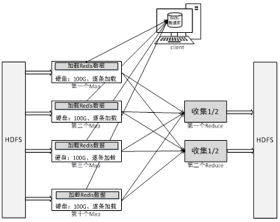

# 实验三十 MapReduce与Spark读写Redis

## 30.1 实验目的  
1.会使用MapReduce访问Redis数据；  
2.会使用Spark访问Redis数据。  

## 30.2 实验要求  
1.使用MapReduce代码读取Redis数据；  
2.使用Spark代码读取Redis数据。  

## 30.3 实验原理  
假定现有一个大为1000G的大表big.txt和一个大小为10G的小表small.txt，请基于MapReduce思想编程实现判断小表中单词在大表中出现次数。也即所谓的“扫描大表、加载小表”。  

为解决上述问题，可开启10个Map。这样，每个Map只需处理总量的1/10，将大大加快处理。而在单独Map内，由于10G的small.txt依旧非常巨大，显然不适宜HashSet加载到内存等措施，此时可借助第三方存储介质（如Redis），在Map阶段先加载部分数据，然后再加载部分数据，甚至，可直接将结果写入Redis如图所示：  
  

## 30.4 实验步骤  
主要包括MapReduce读取Redis代码和Spark读取Redis数据代码。  

### 30.4.1 MapReduce读取Redis  
首先是准备数据阶段，即准备好big.txt并将其上传至HDFS，准备好待查城市名并将其导入Redis。接着为编程阶段，即编写MapReduce程序，在此程序Map阶段，取出Redis里待查城市，顺序扫描数据块里数据，是该城市则输出，不是则不做任何操作。最后，在集群上执行该程序。  

#### 30.4.1.1 准备HDFS数据  
创建big.txt,内容如下:  
```
aaa bbb ccc nanjing eee fff ggg
hhh iii jjj nanjing lll mmm nnn
000 111 222 333 nanjing 555 666 777 888 999
ooo ppp nanjing rrr sss ttt
uuu vvv www nanjing yyy zzz
```  

上传big.txt至HDFS:  
```
root@master:~# hadoop fs -put big.txt /
```  

#### 30.4.1.2 准备Redis数据
进入redis的src目录,登陆redis并写入数据:  
```
172.19.0.2:6379> set city nanjing
OK
172.19.0.2:6379> get city
"nanjing"
```  

#### 30.4.1.3 编程MapReduce程序  
之前的几次实验中觉得还是用开发工具写代码比较方便，这里依旧使用IDEA编写代码。  

编写一般的mapreduce,其实至只用导入两个常用jar包:  
```
hadoop-common-2.7.7.jar  
hadoop-mapreduce-client-core-2.7.7.jar
```
common jar包在**/usr/local/hadoop/share/hadoop/common/**目录下  
mapreduce jar包在**/usr/local/hadoop/share/hadoop/mapreduce/**目录下  
从容器中导出jar包，再导入IDEA项目中  

由于该程序依赖Redis，故，还需添加Redis客户端Jar包, 需要的jar包为**jedis-2.1.0.jar**，(自行从网上下载),最后项目里应导入三个jar包  

代码如下，创建类LargeMemory:  
```java
package cn.cstor.redis;

import java.io.IOException;
import org.apache.hadoop.conf.Configuration;
import org.apache.hadoop.fs.Path;
import org.apache.hadoop.io.IntWritable;
import org.apache.hadoop.io.Text;
import org.apache.hadoop.mapreduce.Job;
import org.apache.hadoop.mapreduce.Mapper;
import org.apache.hadoop.mapreduce.Reducer;
import org.apache.hadoop.mapreduce.lib.input.FileInputFormat;
import org.apache.hadoop.mapreduce.lib.output.FileOutputFormat;
import redis.clients.jedis.Jedis;

public class LargeMemory {
    public static class TokenizerMapper extends Mapper<Object, Text, Text, IntWritable> {
        private final static IntWritable one = new IntWritable(1);
        Jedis jedis = null;
        protected void setup(Context context) throws IOException, InterruptedException {
            jedis = new Jedis(context.getConfiguration().get("redisIP"));
            System.out.println("setup ok *^_^* ");
        }
        public void map(Object key, Text value, Context context) throws IOException, InterruptedException {
            String[] values = value.toString().split(" ");
            for (int i = 0; i < values.length; i++) {
                if (jedis.get("city").equals(values[i])) {
                    context.write(new Text(values[i]), one);
                }
            }
        }
    }
    public static class IntSumReducer extends Reducer<Text, IntWritable, Text, IntWritable> {
        private IntWritable result = new IntWritable();
        public void reduce(Text key, Iterable<IntWritable> values, Context context)throws IOException, InterruptedException {
            int sum = 0;
            for (IntWritable val : values) {
                sum += val.get();
            }
            result.set(sum);
            context.write(key, result);
        }
    }
    public static void main(String[] args) throws Exception {
        Configuration conf = new Configuration();
        conf.set("redisIP", args[0]);
        Job job = Job.getInstance(conf, "RedisDemo");
        job.setJarByClass(LargeMemory.class);
        job.setMapperClass(TokenizerMapper.class);
        job.setReducerClass(IntSumReducer.class);
        job.setMapOutputKeyClass(Text.class);
        job.setMapOutputValueClass(IntWritable.class);
        job.setOutputKeyClass(Text.class);
        job.setOutputValueClass(IntWritable.class);
        FileInputFormat.addInputPath(job, new Path(args[1]));
        FileOutputFormat.setOutputPath(job, new Path(args[2]));
        System.exit(job.waitForCompletion(true) ? 0 : 1);
    }
}
```

完整项目如图:  
  

#### 30.4.1.4 打包该程序并执行
IDEA打包jar包的步骤前面有提到过，打包完成后上传至master节点。  

执行jar包，(执行前记得启动hadoop集群):  
```
root@master:~# hadoop jar ex30.jar 172.19.0.2 /big.txt /output
```
**!! (IDEA打包的jar包若指定了主类，记得执行hadoop jar的时候千万不要再带上主类名)**

#### 30.4.1.5 查看结果  
最后我们在/output目录下查看mapreduce的结果:  
```
root@master:~# hadoop fs -cat /output/p*
nanjing	5
```  
实验成功  

### 30.4.2 Spark读取Redis  
和MapReduce相比，使用Spark读写Redis则简单的多，首先登录Redis准备数据；接着，在启动Spark时指定Redis包；最后，在Spark交互式执行界面中直接编写代码访问Redis即可。具体操作如下：  

#### 30.4.2.1 准备Redis数据  
登录Redis，向redis数据库添加数据:  
```
root@master:/usr/local/hadoop/share/hadoop/mapreduce# redis-cli -h 172.19.0.2
172.19.0.2:6379> set chengshi sh,bj,sz,nj,hf
OK
172.19.0.2:6379> get chengshi
"sh,bj,sz,nj,hf"
```  

#### 30.4.2.2 启动SparkShell  
首先启动Spark集群，再启动SparkShell，由于Spark访问Redis时需要Redis客户端jedis，故此处启动Spark时需指定jedis包,启动命令如下: 
```
root@master:~# spark-shell --master spark://master:7077 --jars jedis-2.1.0.jar
```  
记得把jedis-2.1.0.jar上传至master节点  

#### 30.4.2.3 编写访问代码  
```
scala> import redis.clients.jedis.Jedis
import redis.clients.jedis.Jedis

scala> var jd=new Jedis("172.19.0.2",6379)
jd: redis.clients.jedis.Jedis = redis.clients.jedis.Jedis@5fb05c07

scala> var str=jd.get("chengshi")
str: String = sh,bj,sz,nj,hf

scala> var strList=str.split(",")
strList: Array[String] = Array(sh, bj, sz, nj, hf)

scala> val a = sc.parallelize(strList, 3)
a: org.apache.spark.rdd.RDD[String] = ParallelCollectionRDD[0] at parallelize at <console>:31

scala> val b = a.keyBy(_.length)
b: org.apache.spark.rdd.RDD[(Int, String)] = MapPartitionsRDD[1] at keyBy at <console>:33

scala> b.collect
res0: Array[(Int, String)] = Array((2,sh), (2,bj), (2,sz), (2,nj), (2,hf)) 
```  

至此实验完成。


