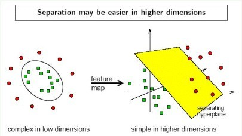

# 实验三十五 使用Spark实现SVM

## 35.1 实验目的  
熟练使用Spark Shell接口；了解SVM（支持向量机）算法原理；理解SVM执行过程；配置Spark处理HDFS数据；使用Spark机器学习包中SVM工具包处理HDFS上数据。  

## 35.2 实验要求  
使用Spark MLlib（机器学习库）中的SVM工具包，训练存储在HDFS上的SVM训练数据集sample_libsvm_data.txt。  

## 35.3 实验原理  
### 35.3.1 SVM算法介绍  
支持向量机SVM(Support Vector Machine)是一种分类算法，通过寻求结构化风险最小来提高学习机泛化能力，实现经验风险和置信范围的最小化，从而达到在统计样本量较少的情况下，亦能获得良好统计规律的目的。通俗来讲，它是一种二类分类模型，其基本模型定义为特征空间上的间隔最大的线性分类器，即支持向量机的学习策略便是间隔最大化，最终可转化为一个凸二次规划问题的求解。  

### 35.3.2 SVM算法原理  
(1)在n维空间中找到一个分类超平面，将空间上的点分类。下图是线性分类的例子。  
  

(2)一般而言，一个点距离超平面的远近可以表示为分类预测的确信或准确程度。SVM就是要最大化这个间隔值。而在虚线上的点便叫做支持向量Supprot Verctor，如图所示:  
  

(3)实际中，我们会经常遇到线性不可分的样例，此时，我们的常用做法是把样例特征映射到高维空间中去，如图所示:  
  

(4)线性不可分映射到高维空间，可能会导致维度大小高到可怕的(19维乃至无穷维的例子)，导致计算复杂。**核函数的价值在于它虽然也是讲特征进行从低维到高维的转换，但核函数绝就绝在它事先在低维上进行计算，而将实质上的分类效果表现在了高维上**，也就如上文所说的避免了直接在高维空间中的复杂计算。  

(5)使用松弛变量处理数据噪音  

## 35.4 实验步骤
### 35.4.1 准备数据集  
网上翻博客时才知道spark其实自带有mllib的一些测试集，都存放在/usr/local/spark/data/mllib目录下。  
```  
root@master:/usr/local/spark/data/mllib# ls
als                sample_binary_classification_data.txt       sample_libsvm_data.txt
gmm_data.txt       sample_fpgrowth.txt                         sample_linear_regression_data.txt
kmeans_data.txt    sample_isotonic_regression_libsvm_data.txt  sample_movielens_data.txt
pagerank_data.txt  sample_kmeans_data.txt                      sample_multiclass_classification_data.txt
pic_data.txt       sample_lda_data.txt                         sample_svm_data.txt
ridge-data         sample_lda_libsvm_data.txt                  streaming_kmeans_data_test.txt
```

这次我们训练SVM模型用到的是sample_libsvm_data.txt,上传至HDFS:  
```
root@master:/usr/local/spark/data/mllib# hadoop fs -put sample_libsvm_data.txt /
root@master:/usr/local/spark/data/mllib# hadoop fs -ls /                        
Found 1 items
-rw-r--r--   2 root supergroup     104736 2018-08-15 03:45 /sample_libsvm_data.txt
```  

### 35.4.2 训练SVM模型  
首先,进入Spark Shell接口:``spark-shell --master spark://master:7077`  

进入Spark Shell命令行执行环境后，依次输入下述代码，即完成模型训练:  
```
import org.apache.spark.mllib.classification.{SVMModel, SVMWithSGD}
import org.apache.spark.mllib.evaluation.BinaryClassificationMetrics
import org.apache.spark.mllib.util.MLUtils  

// 读取样本数据并解析
val data = MLUtils.loadLibSVMFile(sc, "hdfs://master:9000/sample_libsvm_data.txt")  

// 样本数据划分,训练样本占0.6,测试样本占0.4
val splits = data.randomSplit(Array(0.6, 0.4), seed = 11L)
val training = splits(0).cache()
val test = splits(1)  

// 建立模型并训练
val numIterations = 100  
val model = SVMWithSGD.train(training, numIterations)  

// Clear the default threshold.
model.clearThreshold()  

// 对测试样本进行测试.
val scoreAndLabels = test.map { point =>
     val score = model.predict(point.features)
     (score, point.label)
     }
     
val showPredict = scoreAndLabels.take(50)
for (i <- 0 to showPredict.length - 1) {
     println(showPredict(i)._1 + "\t" + showPredict(i)._2 )
     }

// Get evaluation metrics.
val metrics = new BinaryClassificationMetrics(scoreAndLabels)
val auROC = metrics.areaUnderROC()
println("Area under ROC = " + auROC)

// Save and load model
model.save(sc, "/ex35/scalaSVMWithSGDModel")
val sameModel = SVMModel.load(sc, "/ex35/scalaSVMWithSGDModel")
```

## 35.5 实验结果:  
```
scala> val model = SVMWithSGD.train(training, numIterations)
model: org.apache.spark.mllib.classification.SVMModel = org.apache.spark.mllib.classification.SVMModel: intercept = 0.0, numFeatures = 692, numClasses = 2, threshold = 0.0

scala> for (i <- 0 to showPredict.length - 1) {
     | println(showPredict(i)._1 + "\t" + showPredict(i)._2 )
     | }
469979.2995008108	1.0
409813.91764380666	1.0
-692525.9188983737	0.0
640527.2670965025	1.0
-1342088.35278675	0.0
-1232470.0937652218	0.0
504815.7007044771	1.0
605335.8885334346	1.0
700075.5208877418	1.0
-891231.0201690728	0.0
288391.7125601871	1.0
620397.1821659137	1.0
-1204906.844715124	0.0
23144.950453109708	1.0
-831954.8323241578	0.0
-766050.7184750051	0.0
450758.31261742243	1.0
522172.9755402942	1.0
-595571.3337408775	0.0
-716385.5757357273	0.0
-167201.52997604897	1.0
715969.2680567506	1.0
-313396.079437621	0.0
-828890.6554005293	0.0
779420.0661456317	1.0
-331140.5929403065	0.0
407153.9706365334	1.0
-1361055.57425573	0.0
-1400480.1865512524	0.0
-934471.1021252569	0.0
556676.936695566	1.0
-881841.4791703771	0.0
631049.9894640943	1.0
-1126878.378384991	0.0
271017.71127357666	1.0
535286.5423842352	1.0
-1121176.4828332886	0.0
351138.1755469776	1.0
583027.9520387948	1.0
830897.8442067509	1.0
-1209648.6096270122	0.0
-1069061.775648561	0.0
510291.2375065277	1.0

scala> val auROC = metrics.areaUnderROC()
auROC: Double = 1.0  

scala> val sameModel = SVMModel.load(sc, "/ex35/scalaSVMWithSGDModel")
sameModel: org.apache.spark.mllib.classification.SVMModel = org.apache.spark.mllib.classification.SVMModel: intercept = 0.0, numFeatures = 692, numClasses = 2, threshold = None

```