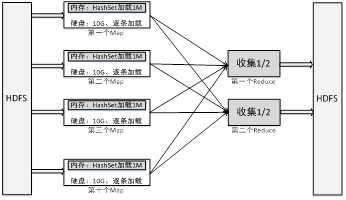

# 实验九  MapReduce实验：分布式缓存

## 9.1 实验目的
理解序列化与反序列化；熟悉Configuration类；学会使用Configuration类进行参数传递；学会在Map或Reduce阶段引用Configuration传来的参数；理解分布式缓存“加载小表、扫描大表”的处理思想。

## 9.2 实验要求
假定现有一个大为100G的大表 big.txt 和一个大小为1M的小表 small.txt，请基于MapReduce思想编程实现判断小表中单词在大表中出现次数。也即所谓的**“扫描大表、加载小表”**。

## 9.3 实验步骤
为解决上述问题，可开启10个Map, 这样，每个Map只需处理总量的1/10，将大大加快处理。而在单独Map内，直接用**HashSet**加载“1M小表”，对于存在硬盘（Map处理时会将HDFS文件拷贝至本地）的10G大文件，则逐条扫描，这就是所谓的“扫描大表、加载小表”，也即分布式缓存，如图所示：  
  

由于实验中没有100G这样的大表，甚至连1M这样的小表都没有，因为本实验采用模拟方式，用少量数据代表大文件big.txt，更少量数据代表small.txt。整个实验步骤为“准备数据->上传数据->编写代码->执行代码->查看结果”这五大步骤。

### 9.3.1 准备数据
为降低操作难度，此处用少量数据代表大文件big.txt，更少量数据代表小文件small.txt。  
big.txt:  
```
aaa bbb ccc ddd eee fff ggg
hhh iii jjj kkk lll mmm nnn
000 111 222 333 444 555 666 777 888 999
ooo ppp qqq rrr sss ttt
uuu vvv www xxx yyy zzz
```
small.txt:   
```
eee sss 555
```

### 9.3.2 上传数据
```
root@master:~/experiment8# hadoop fs -put big.txt /
root@master:~/experiment8# hadoop fs -put small.txt /
```

### 9.3.3 编写代码
完整代码：  
```java
import java.io.IOException;
import java.util.HashSet;

import org.apache.hadoop.conf.Configuration;
import org.apache.hadoop.fs.FSDataInputStream;
import org.apache.hadoop.fs.FileSystem;
import org.apache.hadoop.fs.Path;
import org.apache.hadoop.io.IntWritable;
import org.apache.hadoop.io.Text;
import org.apache.hadoop.mapreduce.Job;
import org.apache.hadoop.mapreduce.Mapper;
import org.apache.hadoop.mapreduce.Reducer;
import org.apache.hadoop.mapreduce.lib.input.FileInputFormat;
import org.apache.hadoop.mapreduce.lib.output.FileOutputFormat;
import org.apache.hadoop.util.LineReader;
 
public class BigAndSmallTable {
        public static class TokenizerMapper extends Mapper<Object, Text, Text, IntWritable> {
        private final static IntWritable one = new IntWritable(1);
        private static HashSet<String> smallTable = null;
 
        protected void setup(Context context) throws IOException, InterruptedException {
            smallTable = new HashSet<String>();
            Path smallTablePath = new Path(context.getConfiguration().get("smallTableLocation"));
            FileSystem hdfs = smallTablePath.getFileSystem(context.getConfiguration());
            FSDataInputStream hdfsReader = hdfs.open(smallTablePath);
            Text line = new Text();
            LineReader lineReader = new LineReader(hdfsReader);
            while (lineReader.readLine(line) > 0) {
            // you can do something here
            String[] values = line.toString().split(" ");
            for (int i = 0; i < values.length; i++) {
                 smallTable.add(values[i]);
                 System.out.println(values[i]);
            }
        }
        lineReader.close();
        hdfsReader.close();
        System.out.println("setup ok *^_^* ");
    }
 
public void map(Object key, Text value, Context context) 
                    throws IOException, InterruptedException {
                String[] values = value.toString().split(" ");
                for (int i = 0; i < values.length; i++) {
                    if (smallTable.contains(values[i])) {
                        context.write(new Text(values[i]), one);
                    }
                }
        }
}
 
public static class IntSumReducer extends Reducer<Text, IntWritable, Text, IntWritable> {
        private IntWritable result = new IntWritable();
 
        public void reduce(Text key, Iterable<IntWritable> values,
                Context context) throws IOException, InterruptedException {
                    int sum = 0;
                    for (IntWritable val : values) {
                        sum += val.get();
                    }
                    result.set(sum);
                    context.write(key, result);
        }
}
 
public static void main(String[] args) throws Exception {
        Configuration conf = new Configuration();
        conf.set("smallTableLocation", args[1]);
        Job job = Job.getInstance(conf, "BigAndSmallTable");
        job.setJarByClass(BigAndSmallTable.class);
        job.setMapperClass(TokenizerMapper.class);
        job.setReducerClass(IntSumReducer.class);
        job.setMapOutputKeyClass(Text.class);
        job.setMapOutputValueClass(IntWritable.class);
        job.setOutputKeyClass(Text.class);
        job.setOutputValueClass(IntWritable.class);
        FileInputFormat.addInputPath(job, new Path(args[0]));
        FileOutputFormat.setOutputPath(job, new Path(args[2]));
        System.exit(job.waitForCompletion(true) ? 0 : 1);
    }
}
```
创建BigAndSmallTable.java，复制代码并编译。　

打包成jar包:  
`root@master:~/experiment8# jar -cvf BigAndSmallTable.jar *.class`

### 9.3.4 执行代码
```
root@master:~/experiment8# hadoop jar BigAndSmallTable.jar BigAndSmallTable /big.txt /small.txt /output
```

## 9.4 实验结果
```
root@master:~/experiment8# hadoop fs -cat /output/p*
555	1
eee	1
sss	1
```
完成实验


