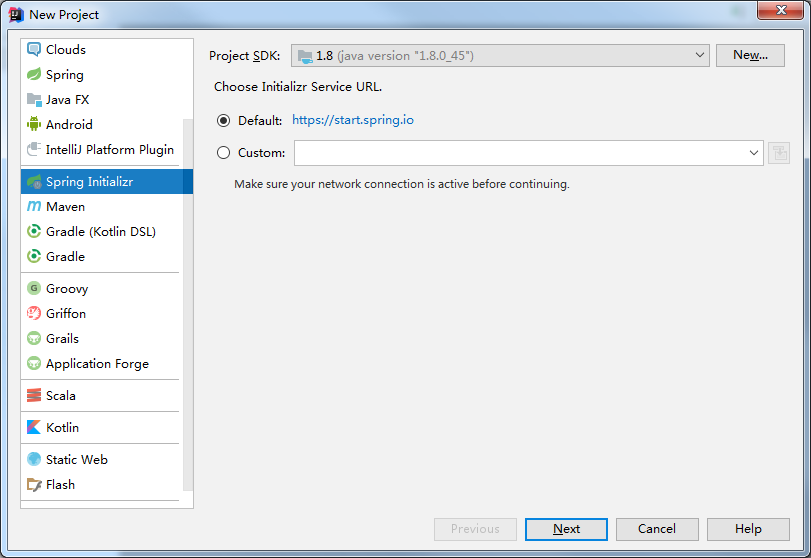
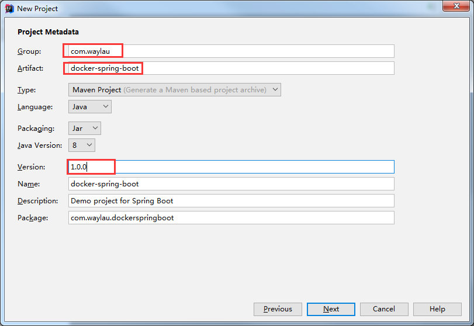
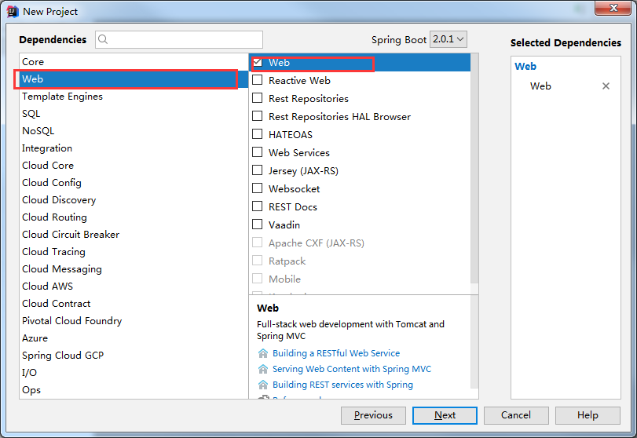
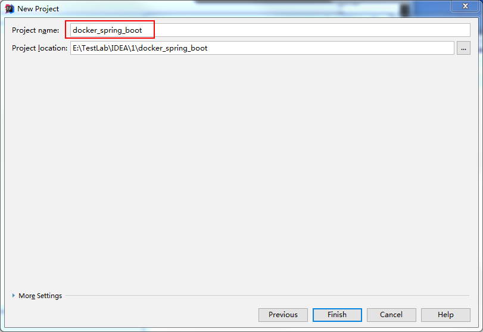
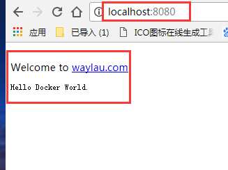
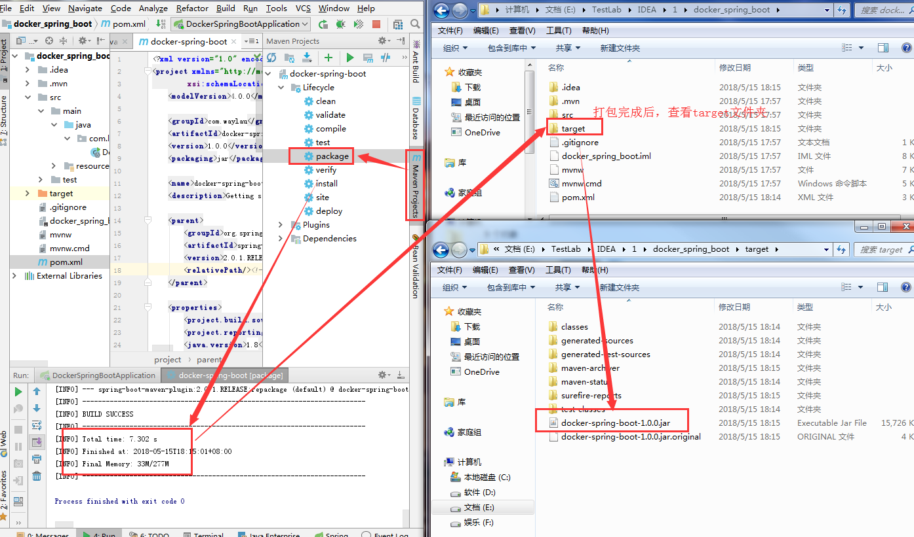

# 基于Docker构建发布一个简单的Spring Boot应用 #
 ## 环境配置 ## 
> * JDK1.8
> * Maven
> * IDEAJ
> * CentOS7
> * Docker1.7+
 ## 搭建过程 ## 

### 1. 使用IDEAJ快速生成以第一个Spring Boot Demo ###
####（1）新建spring demo 工程 ####


####（2）设置springboot demo参数 ####


####（3）设置springboot项目类型 ####

	
####（4）设置项目名称 ####

 ### 2.修改pom.xml ###
修改pom.xml文件如下：
```xml
<?xml version="1.0" encoding="UTF-8"?>
<project xmlns="http://maven.apache.org/POM/4.0.0" xmlns:xsi="http://www.w3.org/2001/XMLSchema-instance"
    xsi:schemaLocation="http://maven.apache.org/POM/4.0.0 http://maven.apache.org/xsd/maven-4.0.0.xsd">
    <modelVersion>4.0.0</modelVersion>

    <groupId>com.waylau</groupId>
    <artifactId>docker-spring-boot</artifactId>
    <version>1.0.0</version>
    <packaging>jar</packaging>

    <name>docker-spring-boot</name>
    <description>Getting started with Spring Boot and Docker</description>

    <parent>
        <groupId>org.springframework.boot</groupId>
        <artifactId>spring-boot-starter-parent</artifactId>
        <version>2.0.1.RELEASE</version>
        <relativePath/><!-- lookup parent from repository -->
    </parent>

    <properties>
        <project.build.sourceEncoding>UTF-8</project.build.sourceEncoding>
        <project.reporting.outputEncoding>UTF-8</project.reporting.outputEncoding>
        <java.version>1.8</java.version>
        <project.build.sourceEncoding>UTF-8</project.build.sourceEncoding>
        <docker.image.prefix>waylau</docker.image.prefix>
        <spring.boot.version>2.0.1.RELEASE</spring.boot.version>
    </properties>

    <dependencies>
        <dependency>
            <groupId>org.springframework.boot</groupId>
            <artifactId>spring-boot-starter-web</artifactId>
        </dependency>

        <dependency>
            <groupId>org.springframework.boot</groupId>
            <artifactId>spring-boot-starter-test</artifactId>
            <scope>test</scope>
        </dependency>
    </dependencies>

    <build>
        <plugins>
            <plugin>
                <groupId>org.springframework.boot</groupId>
                <artifactId>spring-boot-maven-plugin</artifactId>
            </plugin>

            <!-- tag::plugin[] -->
            <plugin>
                <groupId>com.spotify</groupId>
                <artifactId>docker-maven-plugin</artifactId>
                <version>0.4.13</version>
                <configuration>
                    <imageName>${docker.image.prefix}/${project.artifactId}</imageName>
                    <dockerDirectory>src/main/docker</dockerDirectory>
                    <resources>
                        <resource>
                            <targetPath>/</targetPath>
                            <directory>${project.build.directory}</directory>
                            <include>${project.build.finalName}.jar</include>
                        </resource>
                    </resources>
                </configuration>
            </plugin>
            <!-- end::plugin[] -->
        </plugins>
    </build>

</project>
```

注意：
     Maven内置变量说明： 
     ${basedir} 项目根目录
     ${project.build.directory} 构建目录，缺省为target
     ${project.build.outputDirectory} 构建过程输出目录，缺省为target/classes
     ${project.build.finalName} 产出物名称，缺省为${project.artifactId}-${project.version}
     ${project.packaging} 打包类型，缺省为jar
     ${project.xxx} 当前pom文件的任意节点的内容

 ### 3.编写简单的Springboot主应用HelloWorld代码  ###
修改 src\main\java\com\waylau\docker_spring_boot\DockerSpringBootApplication.java

```java
    import org.springframework.boot.SpringApplication;
    import org.springframework.boot.autoconfigure.SpringBootApplication;
    import org.springframework.web.bind.annotation.RequestMapping;
    import org.springframework.web.bind.annotation.RequestMethod;
    import org.springframework.web.bind.annotation.RestController;
    
    @SpringBootApplication
    @RestController
    public class DockerSpringBootApplication {
    
    	@RequestMapping(value = "/",method = RequestMethod.GET)
    	public String home() {
    		return "Hello Docker World."
    				+ "<br />Welcome to <a href='http://waylau.com'>waylau.com</a></li>";
    	}
    
    	public static void main(String[] args) {
    		SpringApplication.run(DockerSpringBootApplication.class, args);
    	}
    }
```

注意：
    @SpringBootApplication 表示是SpringBoot应用,
    @RestController 表示以Restful风格返回,
    @RequestMapping(value = "/",method = RequestMethod.GET) 表示请求映射


### 4.项目运行与打包  ###
#### （1）编译项目 #### 


#### （2）运行项目  #### 
运行项目后，在浏览器里输入：http://localhost:8080/ ，看到如下结果：



#### （3）打包项目  #### 



说明：
打包项目，也可以使用其他方式：在项目根目录
编译生成jar包, 保存到target文件夹内

```shell
$ mvn package
```

#### （4）运行生成的jar包  ####

```shell
$ java -jar target/docker-spring-boot-1.0.0.jar
```

```shell
>>
  .   ____          _            __ _ _
 /\\ / __
_'_ __ _ _(_)_ __  __ _ \ \ \ \
( ( )\___ | '_ | '_| | '_ \/ _` | \ \ \ \
 \\/  ___)| |_)| | | | | || (_| |  ) ) ) )
  '  |____| .__|_| |_|_| |_\__, | / / / /
 =========|_|==============|___/=/_/_/_/
 :: Spring Boot ::        (v2.0.1.RELEASE)

2018-05-14 00:18:45.899  INFO 4152 --- [           main] c.w.d.DockerSpringBootApplication        : Starting DockerSpringBootApplication v1.0.0 on LAPTOP-QVOLDTI6 with PID 4152 (D:\SVN\distributed\springboot_docker\docker-spring-boot\target\docker-spring-boot-1.0.0.jar started by HY in D:\SVN\distributed\springboot_docker\docker-spring-boot)
2018-05-14 00:18:45.915  INFO 4152 --- [           main] c.w.d.DockerSpringBootApplication        : No active profile set, falling back to default profiles: default
2018-05-14 00:18:46.040  INFO 4152 --- [           main] ConfigServletWebServerApplicationContext : Refreshing org.springframework.boot.web.servlet.context.AnnotationConfigServletWebServerApplicationContext@7cef4e59: startup date [Mon May 14 00:18:46 CST 2018]; root of context hierarchy
2018-05-14 00:18:48.415  INFO 4152 --- [           main] o.s.b.w.embedded.tomcat.TomcatWebServer  : Tomcat initialized with port(s): 8080 (http)
2018-05-14 00:18:48.478  INFO 4152 --- [           main] o.apache.catalina.core.StandardService   : Starting service [Tomcat]
2018-05-14 00:18:48.478  INFO 4152 --- [           main] org.apache.catalina.core.StandardEngine  : Starting Servlet Engine: Apache Tomcat/8.5.29
2018-05-14 00:18:48.493  INFO 4152 --- [ost-startStop-1] o.a.catalina.core.AprLifecycleListener   : The APR based Apache Tomcat Native library which allows optimal performance in production environments was not found on the java.library.path: [C:\ProgramData\Oracle\Java\javapath;C:\WINDOWS\Sun\Java\bin;C:\WINDOWS\system32;C:\WINDOWS;C:\Python27\Scripts\bin\Bin\;C:\ProgramData\Oracle\Java\javapath;C:\Program Files\Java\jdk1.8.0_121\bin;C:\Program Files\Java\jdk1.8.0_121\jre\bin\C:\Program Files (x86)\Intel\iCLS Client\;C:\Program Files\Intel\iCLS Client\;C:\Windows\system32;C:\Windows;C:\Windows\System32\Wbem;C:\Windows\System32\WindowsPowerShell\v1.0\;C:\Program Files (x86)\Intel\Intel(R) Management Engine Components\DAL;C:\Program Files\Intel\Intel(R) Management Engine Components\DAL;C:\Program Files (x86)\Intel\Intel(R) Management Engine Components\IPT;C:\Program Files\Intel\Intel(R) Management Engine Components\IPT;C:\Program Files (x86)\NVIDIA Corporation\PhysX\Common;C:\Program Files\Intel\WiFi\bin\;C:\Program Files\Common Files\Intel\WirelessCommon\;C:\Program Files\Microsoft\Web Platform Installer\;C:\Program Files (x86)\Microsoft ASP.NET\ASP.NET Web Pages\v1.0\;C:\Program Files (x86)\Windows Kits\8.0\Windows Performance Toolkit\;C:\Program Files\Microsoft SQL Server\110\Tools\Binn\;C:\Python27\;E:\Git\cmd\;D:\Qt\bin\;D:\MinGW\bin\;C:\Python27\Scripts\graphviz-2.38\release\bin;C:\Python27\Scripts\;D:\MicrosoftMPI\Bin\;C:\Users\HY\pc2-9.5.2\bin\;C:\Program Files (x86)\GtkSharp\2.12\bin;C:\WINDOWS\system32;C:\WINDOWS;C:\WINDOWS\System32\Wbem;C:\WINDOWS\System32\WindowsPowerShell\v1.0\;D:\apache-maven-3.5.3\bin;C:\Program Files\TortoiseSVN\bin;C:\Users\HY\AppData\Local\Microsoft\WindowsApps;.]
2018-05-14 00:18:49.353  INFO 4152 --- [ost-startStop-1] o.a.c.c.C.[Tomcat].[localhost].[/]       : Initializing Spring embedded WebApplicationContext
2018-05-14 00:18:49.353  INFO 4152 --- [ost-startStop-1] o.s.web.context.ContextLoader            : Root WebApplicationContext: initialization completed in 3313 ms
2018-05-14 00:18:49.540  INFO 4152 --- [ost-startStop-1] o.s.b.w.servlet.ServletRegistrationBean  : Servlet dispatcherServlet mapped to [/]
2018-05-14 00:18:49.556  INFO 4152 --- [ost-startStop-1] o.s.b.w.servlet.FilterRegistrationBean   : Mapping filter: 'characterEncodingFilter' to: [/*]
2018-05-14 00:18:49.556  INFO 4152 --- [ost-startStop-1] o.s.b.w.servlet.FilterRegistrationBean   : Mapping filter: 'hiddenHttpMethodFilter' to: [/*]
2018-05-14 00:18:49.556  INFO 4152 --- [ost-startStop-1] o.s.b.w.servlet.FilterRegistrationBean   : Mapping filter: 'httpPutFormContentFilter' to: [/*]
2018-05-14 00:18:49.556  INFO 4152 --- [ost-startStop-1] o.s.b.w.servlet.FilterRegistrationBean   : Mapping filter: 'requestContextFilter' to: [/*]
2018-05-14 00:18:49.744  INFO 4152 --- [           main] o.s.w.s.handler.SimpleUrlHandlerMapping  : Mapped URL path [/**/favicon.ico] onto handler of type [class org.springframework.web.servlet.resource.ResourceHttpRequestHandler]
2018-05-14 00:18:50.150  INFO 4152 --- [           main] s.w.s.m.m.a.RequestMappingHandlerAdapter : Looking for @ControllerAdvice: org.springframework.boot.web.servlet.context.AnnotationConfigServletWebServerApplicationContext@7cef4e59: startup date [Mon May 14 00:18:46 CST 2018]; root of context hierarchy
2018-05-14 00:18:50.291  INFO 4152 --- [           main] s.w.s.m.m.a.RequestMappingHandlerMapping : Mapped "{[/],methods=[GET]}" onto public java.lang.String com.waylau.docker_spring_boot.DockerSpringBootApplication.home()
2018-05-14 00:18:50.291  INFO 4152 --- [           main] s.w.s.m.m.a.RequestMappingHandlerMapping : Mapped "{[/error]}" onto public org.springframework.http.ResponseEntity<java.util.Map<java.lang.String, java.lang.Object>> org.springframework.boot.autoconfigure.web.servlet.error.BasicErrorController.error(javax.servlet.http.HttpServletRequest)
2018-05-14 00:18:50.306  INFO 4152 --- [           main] s.w.s.m.m.a.RequestMappingHandlerMapping : Mapped "{[/error],produces=[text/html]}" onto public org.springframework.web.servlet.ModelAndView org.springframework.boot.autoconfigure.web.servlet.error.BasicErrorController.errorHtml(javax.servlet.http.HttpServletRequest,javax.servlet.http.HttpServletResponse)
2018-05-14 00:18:50.384  INFO 4152 --- [           main] o.s.w.s.handler.SimpleUrlHandlerMapping  : Mapped URL path [/webjars/**] onto handler of type [class org.springframework.web.servlet.resource.ResourceHttpRequestHandler]
2018-05-14 00:18:50.384  INFO 4152 --- [           main] o.s.w.s.handler.SimpleUrlHandlerMapping  : Mapped URL path [/**] onto handler of type [class org.springframework.web.servlet.resource.ResourceHttpRequestHandler]
2018-05-14 00:18:50.619  INFO 4152 --- [           main] o.s.j.e.a.AnnotationMBeanExporter        : Registering beans for JMX exposure on startup
2018-05-14 00:18:50.759  INFO 4152 --- [           main] o.s.b.w.embedded.tomcat.TomcatWebServer  : Tomcat started on port(s): 8080 (http) with context path ''
2018-05-14 00:18:50.775  INFO 4152 --- [           main] c.w.d.DockerSpringBootApplication        : Started DockerSpringBootApplication in 5.5 seconds (JVM running for 6.762)
```

 ## #5.使用docker容器部署项目
创建文件 `src/main/docker/Dockerfile`:

```dockerfile
FROM frolvlad/alpine-oraclejdk8:slim
VOLUME /tmp
ADD docker-spring-boot-1.0.0.jar app.jar
ENTRYPOINT ["java","-Djava.security.egd=file:/dev/./urandom","-jar","/app.jar"]
```

- `VOLUME` 指定了临时文件目录为`/tmp`。其效果是在主机 `/var/lib/docker` 目录下创建了一个临时文件，并链接到容器的`/tmp`。该步骤是可选的。`/tmp`目录用来持久化到 Docker 数据文件夹，因为 Spring Boot 使用的内嵌 Tomcat 容器默认使用`/tmp`作为工作目录
- 项目的 jar 文件作为 "app.jar" 添加到容器的
- `ENTRYPOINT` 执行项目 app.jar。为了缩短 [Tomcat 启动时间](http://wiki.apache.org/tomcat/HowTo/FasterStartUp#Entropy_Source)，添加一个系统属性指向 "/dev/urandom" 作为 Entropy Source

在安装有docker的CentOS7主机中（如果没有mvn，先安装maven），执行构建成为 docker image:

```shell
$ mvn package docker:build
```

运行 Docker Image

```shell
$ docker run -p 8080:8080 -t waylau/docker-spring-boot
```

```shell
>>

  .   ____          _            __ _ _
 /\\ / ___'_ __ _ _(_)_ __  __ _ \ \ \ \
( ( )\___ | '_ | '_| | '_ \/ _` | \ \ \ \
 \\/  ___)| |_)| | | | | || (_| |  ) ) ) )
  '  |____| .__|_| |_|_| |_\__, | / / / /
 =========|_|==============|___/=/_/_/_/
 :: Spring Boot ::        (v2.0.1.RELEASE)

2018-05-14 00:18:45.899  INFO 4152 --- [           main] c.w.d.DockerSpringBootApplication        : Starting DockerSpringBootApplication v1.0.0 on LAPTOP-QVOLDTI6 with PID 4152 (D:\SVN\distributed\springboot_docker\docker-spring-boot\target\docker-spring-boot-1.0.0.jar started by HY in D:\SVN\distributed\springboot_docker\docker-spring-boot)
2018-05-14 00:18:45.915  INFO 4152 --- [           main] c.w.d.DockerSpringBootApplication        : No active profile set, falling back to default profiles: default
2018-05-14 00:18:46.040  INFO 4152 --- [           main] ConfigServletWebServerApplicationContext : Refreshing org.springframework.boot.web.servlet.context.AnnotationConfigServletWebServerApplicationContext@7cef4e59: startup date [Mon May 14 00:18:46 CST 2018]; root of context hierarchy
2018-05-14 00:18:48.415  INFO 4152 --- [           main] o.s.b.w.embedded.tomcat.TomcatWebServer  : Tomcat initialized with port(s): 8080 (http)
2018-05-14 00:18:48.478  INFO 4152 --- [           main] o.apache.catalina.core.StandardService   : Starting service [Tomcat]
2018-05-14 00:18:48.478  INFO 4152 --- [           main] org.apache.catalina.core.StandardEngine  : Starting Servlet Engine: Apache Tomcat/8.5.29
2018-05-14 00:18:48.493  INFO 4152 --- [ost-startStop-1] o.a.catalina.core.AprLifecycleListener   : The APR based Apache Tomcat Native library which allows optimal performance in production environments was not found on the java.library.path: [C:\ProgramData\Oracle\Java\javapath;C:\WINDOWS\Sun\Java\bin;C:\WINDOWS\system32;C:\WINDOWS;C:\Python27\Scripts\bin\Bin\;C:\ProgramData\Oracle\Java\javapath;C:\Program Files\Java\jdk1.8.0_121\bin;C:\Program Files\Java\jdk1.8.0_121\jre\bin\C:\Program Files (x86)\Intel\iCLS Client\;C:\Program Files\Intel\iCLS Client\;C:\Windows\system32;C:\Windows;C:\Windows\System32\Wbem;C:\Windows\System32\WindowsPowerShell\v1.0\;C:\Program Files (x86)\Intel\Intel(R) Management Engine Components\DAL;C:\Program Files\Intel\Intel(R) Management Engine Components\DAL;C:\Program Files (x86)\Intel\Intel(R) Management Engine Components\IPT;C:\Program Files\Intel\Intel(R) Management Engine Components\IPT;C:\Program Files (x86)\NVIDIA Corporation\PhysX\Common;C:\Program Files\Intel\WiFi\bin\;C:\Program Files\Common Files\Intel\WirelessCommon\;C:\Program Files\Microsoft\Web Platform Installer\;C:\Program Files (x86)\Microsoft ASP.NET\ASP.NET Web Pages\v1.0\;C:\Program Files (x86)\Windows Kits\8.0\Windows Performance Toolkit\;C:\Program Files\Microsoft SQL Server\110\Tools\Binn\;C:\Python27\;E:\Git\cmd\;D:\Qt\bin\;D:\MinGW\bin\;C:\Python27\Scripts\graphviz-2.38\release\bin;C:\Python27\Scripts\;D:\MicrosoftMPI\Bin\;C:\Users\HY\pc2-9.5.2\bin\;C:\Program Files (x86)\GtkSharp\2.12\bin;C:\WINDOWS\system32;C:\WINDOWS;C:\WINDOWS\System32\Wbem;C:\WINDOWS\System32\WindowsPowerShell\v1.0\;D:\apache-maven-3.5.3\bin;C:\Program Files\TortoiseSVN\bin;C:\Users\HY\AppData\Local\Microsoft\WindowsApps;.]
2018-05-14 00:18:49.353  INFO 4152 --- [ost-startStop-1] o.a.c.c.C.[Tomcat].[localhost].[/]       : Initializing Spring embedded WebApplicationContext
2018-05-14 00:18:49.353  INFO 4152 --- [ost-startStop-1] o.s.web.context.ContextLoader            : Root WebApplicationContext: initialization completed in 3313 ms
2018-05-14 00:18:49.540  INFO 4152 --- [ost-startStop-1] o.s.b.w.servlet.ServletRegistrationBean  : Servlet dispatcherServlet mapped to [/]
2018-05-14 00:18:49.556  INFO 4152 --- [ost-startStop-1] o.s.b.w.servlet.FilterRegistrationBean   : Mapping filter: 'characterEncodingFilter' to: [/*]
2018-05-14 00:18:49.556  INFO 4152 --- [ost-startStop-1] o.s.b.w.servlet.FilterRegistrationBean   : Mapping filter: 'hiddenHttpMethodFilter' to: [/*]
2018-05-14 00:18:49.556  INFO 4152 --- [ost-startStop-1] o.s.b.w.servlet.FilterRegistrationBean   : Mapping filter: 'httpPutFormContentFilter' to: [/*]
2018-05-14 00:18:49.556  INFO 4152 --- [ost-startStop-1] o.s.b.w.servlet.FilterRegistrationBean   : Mapping filter: 'requestContextFilter' to: [/*]
2018-05-14 00:18:49.744  INFO 4152 --- [           main] o.s.w.s.handler.SimpleUrlHandlerMapping  : Mapped URL path [/**/favicon.ico] onto handler of type [class org.springframework.web.servlet.resource.ResourceHttpRequestHandler]
2018-05-14 00:18:50.150  INFO 4152 --- [           main] s.w.s.m.m.a.RequestMappingHandlerAdapter : Looking for @ControllerAdvice: org.springframework.boot.web.servlet.context.AnnotationConfigServletWebServerApplicationContext@7cef4e59: startup date [Mon May 14 00:18:46 CST 2018]; root of context hierarchy
2018-05-14 00:18:50.291  INFO 4152 --- [           main] s.w.s.m.m.a.RequestMappingHandlerMapping : Mapped "{[/],methods=[GET]}" onto public java.lang.String com.waylau.docker_spring_boot.DockerSpringBootApplication.home()
2018-05-14 00:18:50.291  INFO 4152 --- [           main] s.w.s.m.m.a.RequestMappingHandlerMapping : Mapped "{[/error]}" onto public org.springframework.http.ResponseEntity<java.util.Map<java.lang.String, java.lang.Object>> org.springframework.boot.autoconfigure.web.servlet.error.BasicErrorController.error(javax.servlet.http.HttpServletRequest)
2018-05-14 00:18:50.306  INFO 4152 --- [           main] s.w.s.m.m.a.RequestMappingHandlerMapping : Mapped "{[/error],produces=[text/html]}" onto public org.springframework.web.servlet.ModelAndView org.springframework.boot.autoconfigure.web.servlet.error.BasicErrorController.errorHtml(javax.servlet.http.HttpServletRequest,javax.servlet.http.HttpServletResponse)
2018-05-14 00:18:50.384  INFO 4152 --- [           main] o.s.w.s.handler.SimpleUrlHandlerMapping  : Mapped URL path [/webjars/**] onto handler of type [class org.springframework.web.servlet.resource.ResourceHttpRequestHandler]
2018-05-14 00:18:50.384  INFO 4152 --- [           main] o.s.w.s.handler.SimpleUrlHandlerMapping  : Mapped URL path [/**] onto handler of type [class org.springframework.web.servlet.resource.ResourceHttpRequestHandler]
2018-05-14 00:18:50.619  INFO 4152 --- [           main] o.s.j.e.a.AnnotationMBeanExporter        : Registering beans for JMX exposure on startup
2018-05-14 00:18:50.759  INFO 4152 --- [           main] o.s.b.w.embedded.tomcat.TomcatWebServer  : Tomcat started on port(s): 8080 (http) with context path ''
2018-05-14 00:18:50.775  INFO 4152 --- [           main] c.w.d.DockerSpringBootApplication        : Started DockerSpringBootApplication in 5.5 seconds (JVM running for 6.762)
```

在本地浏览器中输入 http://localhost:8080/ 可以看到运行效果


## 源码下载 ## 

##  参考  ##  
1. [用 Docker 构建、运行、发布一个 Spring Boot 应用. https://yq.aliyun.com/articles/47344](https://yq.aliyun.com/articles/47344)